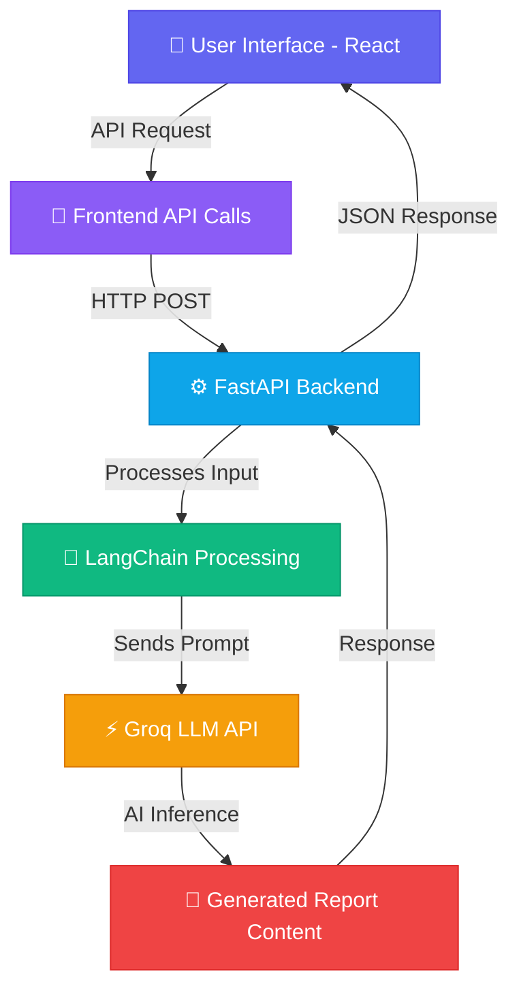

<div align="center">

<!-- Animated Banner -->


<br/>

<!-- Animated Typing Effect -->
<a href="https://git.io/typing-svg">
  
</a>

<br/><br/>

<!-- Badges Row 1 -->
[](https://reactjs.org/)
[](https://fastapi.tiangolo.com/)
[](https://python.org/)
[](https://vitejs.dev/)

<!-- Badges Row 2 -->
[](https://langchain.com/)
[](https://groq.com/)
[](https://vercel.com/)
[](https://framer.com/motion/)

<br/>

<!-- Stats Badges -->


</div>

---

<br/>

## 📌 Problem Statement

> **Creating professional reports manually is time-consuming, repetitive, and draining.**

Many professionals spend **hours** converting raw information into structured documents — time that could be better spent on actual decision-making. SmartReport AI is built to eliminate this bottleneck entirely.

<br/>

---

## 💡 The Solution

<div align="center">

```
📥 Input Raw Data or Prompt
         │
         ▼  ✨ AI Understands Context
         │
         ▼  🧠 LangChain Processing
         │
         ▼  ⚡ Groq LLM Inference
         │
         ▼  📄 Structured Report Generated
         │
         ▼  🖥️ Displayed on Modern UI
```

</div>

SmartReport AI uses **AI-driven text generation and context understanding** to automate the entire reporting workflow — reducing manual effort while dramatically improving productivity.

<br/>

---

## 🧠 Key Features

<table>
<tr>
<td width="50%">

### ✨ AI-Powered Report Generation
Generate structured, insightful reports **instantly** from any prompt or raw data input — no formatting expertise required.

</td>
<td width="50%">

### ⚡ High-Speed AI Inference
Integrated with **Groq API** for blazing-fast LLM responses, so you're never waiting around.

</td>
</tr>
<tr>
<td width="50%">

### 🧩 Context-Aware Intelligence
Uses **LangChain** to maintain conversation context and improve accuracy across multi-turn report sessions.

</td>
<td width="50%">

### 🎨 Modern Interactive UI
Built with **React + Framer Motion** for silky-smooth animations and a delightful user experience.

</td>
</tr>
<tr>
<td width="50%">

### 🌍 Domain-Independent
Works across **Business, Research, Education, Healthcare, Finance**, and beyond. One tool, infinite use cases.

</td>
<td width="50%">

### 🔌 Extensible Architecture
Modular backend and frontend design makes it easy to plug in new AI models, export formats, or data sources.

</td>
</tr>
</table>

<br/>

---

## 🏗️ Tech Stack

<div align="center">

### 🖥️ Frontend

| Technology | Purpose |
|---|---|
|  | Core UI Framework |
|  | Lightning-fast Build Tool |
|  | Animations & Transitions |
|  | Icon Library |

### ⚙️ Backend

| Technology | Purpose |
|---|---|
|  | High-Performance REST API |
|  | Core Backend Language |

### 🤖 AI / LLM Layer

| Technology | Purpose |
|---|---|
| 🦜 **LangChain** | Context Management & Chaining |
| ⚡ **Groq API** | Ultra-Fast LLM Inference |

### 🚀 Deployment

| Technology | Purpose |
|---|---|
|  | Frontend Hosting |
| 🖥️ **FastAPI Server** | Backend Hosting |

</div>

<br/>

---

## ⚙️ System Architecture



<br/>

---

## 📂 Project Structure

```
📦 SmartReportAI
│
├── 📁 backend
│   ├── 🐍 main.py                 # FastAPI entry point
│   ├── 📄 requirements.txt        # Python dependencies
│   ├── 📁 services
│   │   ├── 🤖 llm_service.py      # Groq + LangChain integration
│   │   └── 📊 report_service.py   # Report structuring logic
│   └── 📁 utils
│       └── 🛠️ helpers.py          # Utility functions
│
├── 📁 frontend
│   ├── 📁 src
│   │   ├── 📁 components          # Reusable UI components
│   │   ├── 📁 pages               # Route-level page views
│   │   └── 📁 assets              # Static files & styles
│   ├── ⚡ vite.config.js          # Vite configuration
│   └── 📦 package.json
│
└── 📖 README.md
```

<br/>

---

## 🚀 Getting Started

### Prerequisites

Before you begin, ensure you have the following installed:

- 
- 
- A valid **Groq API Key** — get one at [console.groq.com](https://console.groq.com)

---

### 1️⃣ Clone the Repository

```bash
git clone https://github.com/yourusername/SmartReportAI.git
cd SmartReportAI
```

---

### 2️⃣ Backend Setup

```bash
# Navigate to backend
cd backend

# Create & activate virtual environment
python -m venv venv
venv\Scripts\activate        # Windows
# source venv/bin/activate   # macOS/Linux

# Install dependencies
pip install -r requirements.txt

# Add your API Key in .env
echo "GROQ_API_KEY=your_key_here" > .env

# Start the backend server
uvicorn main:app --reload
```

> 🟢 Backend live at: **http://127.0.0.1:8000**
> 
> 📚 API Docs at: **http://127.0.0.1:8000/docs**

---

### 3️⃣ Frontend Setup

```bash
# Navigate to frontend
cd frontend

# Install dependencies
npm install

# Start development server
npm run dev
```

> 🟢 Frontend live at: **http://localhost:5173**

<br/>

---

## 🌐 API Reference

| Method | Endpoint | Description |
|--------|----------|-------------|
| `POST` | `/generate-report` | Generate a report from prompt/data |
| `GET`  | `/health` | Check API health status |
| `POST` | `/summarize` | Summarize raw input text |

<br/>

---

## 📈 Roadmap & Future Improvements

```
✅ MVP — AI Report Generation via Prompt
✅ LangChain Context Awareness
✅ Groq API Integration
✅ React + Framer Motion UI

🔜 Coming Soon...
┌─────────────────────────────────────────────────┐
│  📄  Export Reports as PDF / DOCX               │
│  📊  Data Visualization Integration             │
│  🧠  Multi-Agent AI Workflows                   │
│  🗂️  Report History & Storage                   │
│  🔐  User Authentication System                 │
│  🌙  Dark Mode Support                          │
│  📱  Mobile-Responsive Redesign                 │
└─────────────────────────────────────────────────┘
```

<br/>

---

## 🤝 Contributing

Contributions are always welcome! Here's how to get started:

1. **Fork** the repository
2. **Create** your feature branch: `git checkout -b feature/AmazingFeature`
3. **Commit** your changes: `git commit -m 'Add some AmazingFeature'`
4. **Push** to the branch: `git push origin feature/AmazingFeature`
5. **Open** a Pull Request 🎉

Please read our [Contributing Guidelines](CONTRIBUTING.md) before submitting.

<br/>

---

## 📄 License

This project is licensed under the **MIT License** — see the [LICENSE](LICENSE) file for details.

<br/>

---

## 🙏 Acknowledgements

- [Groq](https://groq.com/) — for blazing-fast LLM inference
- [LangChain](https://langchain.com/) — for powerful LLM orchestration
- [FastAPI](https://fastapi.tiangolo.com/) — for the elegant Python backend
- [Framer Motion](https://www.framer.com/motion/) — for smooth, beautiful animations

<br/>

---

<div align="center">

<!-- Footer Wave -->


**Built with ❤️ by the SmartReport AI Team**

⭐ Star this repo if you find it helpful!

[](https://github.com/yourusername)

</div>
