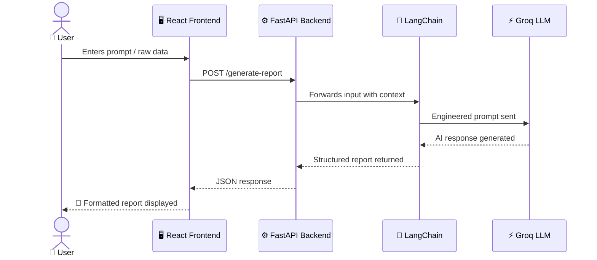
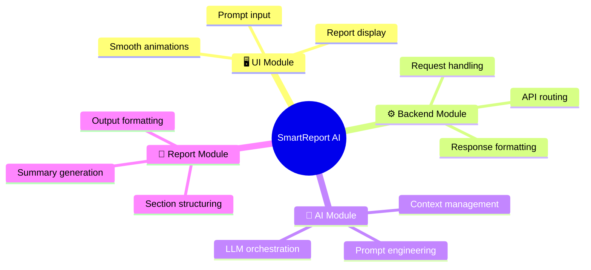

<div align="center">


<br/>

<br/><br/>

<!-- Glowing profile stats strip -->

&nbsp;

&nbsp;


<br/><br/>


<br/><br/>


&nbsp;

&nbsp;


</div>

---

<br/>

## 🎯 What is SmartReport AI?


**SmartReport AI** is a fully deployed, AI-powered reporting platform that converts raw input — prompts, descriptions, or contextual data — into clean, structured, professional reports **in seconds**.

It acts as an intelligent reporting assistant for:

- 🏢 Business professionals writing analytics reports
- 🎓 Students and researchers creating academic summaries
- 🏥 Healthcare teams drafting clinical documentation
- 📊 Analysts generating market or corporate reports
- 🧑‍💻 Developers needing technical documentation fast

> **One-liner:** Type your data in. Get a professional report out.

<br clear="right"/>

---

## 🔴 The Problem

Manual report writing is a **productivity trap**.

Professionals across industries spend hours each week:

- Reorganizing raw, unstructured data
- Writing summaries from scratch
- Formatting sections consistently
- Rewriting content for clarity and flow

This process is **repetitive**, **error-prone**, and **inefficient** — time that should be spent on decision-making, not documentation.

---

## 🟢 The Solution

SmartReport AI automates the entire reporting workflow in **3 steps**:

<div align="center">

```
╔══════════════════════════════════════════════════════════╗
║                                                          ║
║   [ 1 ]  Enter your prompt, description, or raw data    ║
║                          ↓                              ║
║   [ 2 ]  AI analyzes, understands, and structures it    ║
║                          ↓                              ║
║   [ 3 ]  Receive a complete, formatted report instantly  ║
║                                                          ║
╚══════════════════════════════════════════════════════════╝
```

</div>

No formatting. No rewriting. No wasted time.

---

<br/>

## ✅ Core Features

<div align="center">

| # | Feature | Description |
|:---:|---|---|
| 01 | ✨ **AI Report Generation** | Instantly converts any prompt or raw data into a structured report |
| 02 | 🧠 **Context-Aware Processing** | LangChain maintains context for accurate, coherent multi-part reports |
| 03 | ⚡ **High-Speed Inference** | Groq API delivers LLM responses at exceptional speeds |
| 04 | 🎨 **Animated Modern UI** | React + Vite + Framer Motion — fast, responsive, smooth |
| 05 | 🌍 **Domain-Independent** | Works across business, research, healthcare, analytics & more |
| 06 | 🔌 **Full-Stack Architecture** | Clean separation between UI, API, and AI processing layers |

</div>

<br/>

---

## 🏗️ System Architecture



<br/>

---

## ⚙️ Technology Stack

<div align="center">

### 🖥️ Frontend

| Tech | Role |
|---|---|
|  | Core UI framework |
|  | Fast build & dev server |
|  | Animations & transitions |
|  | UI icon library |

### ⚙️ Backend

| Tech | Role |
|---|---|
|  | REST API framework |
|  | Core backend language |

### 🤖 AI Layer

| Tech | Role |
|---|---|
| ⚡ **Groq API** | Ultra-fast LLM inference engine |
| 🦜 **LangChain** | Prompt engineering & context management |

### 🚀 Deployment

| Tech | Role |
|---|---|
|  | Frontend hosting |
| ☁️ **Cloud Server** | FastAPI backend hosting |

</div>

<br/>

---

## 📂 Project Modules



<br/>

---

## 📂 Project Structure

```bash
SmartReportAI/
│
├── 🗂️  backend/
│   ├── 🐍  main.py                   # FastAPI entry point
│   ├── 📋  requirements.txt          # Python dependencies
│   ├── ⚙️  services/
│   │   ├── llm_service.py            # Groq + LangChain integration
│   │   └── report_service.py         # Report structuring logic
│   └── 🛠️  utils/
│       └── helpers.py                # Utility functions
│
├── 🗂️  frontend/
│   └── 📁  src/
│       ├── components/               # Reusable UI components
│       ├── pages/                    # Full route-level views
│       └── assets/                   # Images, icons, styles
│
└── 📖  README.md
```

<br/>

---

## 🚀 Getting Started

> **Requirements:** Node.js v18+ &nbsp;·&nbsp; Python 3.10+ &nbsp;·&nbsp; Groq API Key → [console.groq.com](https://console.groq.com)

---

### `1` Clone the Repository

```bash
git clone https://github.com/yourusername/SmartReportAI.git
cd SmartReportAI
```

---

### `2` Backend Setup

```bash
cd backend

# Create virtual environment
python -m venv venv
venv\Scripts\activate            # Windows
# source venv/bin/activate       # macOS / Linux

# Install dependencies
pip install -r requirements.txt

# Set your API key
echo "GROQ_API_KEY=your_key_here" > .env

# Start the server
uvicorn main:app --reload
```

<div align="center">

| 🟢 API Live | 📘 Swagger Docs |
|---|---|
| `http://127.0.0.1:8000` | `http://127.0.0.1:8000/docs` |

</div>

---

### `3` Frontend Setup

```bash
cd frontend
npm install
npm run dev
```

<div align="center">

| 🟢 App Live |
|---|
| `http://localhost:5173` |

</div>

<br/>

---

## 🌐 API Endpoints

<div align="center">

| Method | Endpoint | Description |
|:---:|---|---|
| `POST` | `/generate-report` | Generate a structured report from input |
| `GET` | `/health` | Server health check |
| `POST` | `/summarize` | Summarize raw text |

</div>

<br/>

---

## 📊 Project Status

<div align="center">

```
 COMPLETED ✅
─────────────────────────────────────────────────────────────────
  ✅  Frontend — React + Vite + Framer Motion UI
  ✅  Backend  — FastAPI server with full API routing
  ✅  AI Layer — Groq API + LangChain integration
  ✅  Report Generation — Structured AI-powered output
  ✅  Local testing and debugging
  ✅  Cloud deployment — Vercel (frontend) + Server (backend)
  ✅  System optimization

 UPCOMING 🔜
─────────────────────────────────────────────────────────────────
  🔜  Export reports as PDF / DOCX
  🔜  Data visualization integration
  🔜  Multi-agent AI workflows
  🔜  Report history & storage
  🔜  Scalable cloud infrastructure
```

</div>

<br/>

---

## 🎯 Project Impact

SmartReport AI directly addresses a real productivity gap in professional workflows.

By automating documentation, it allows users to:

- **Spend less time** formatting and restructuring reports
- **Focus more** on analysis, insights, and decisions
- **Scale output** without scaling effort
- **Maintain consistency** across all generated documents

Whether you're a solo researcher or a team of analysts, SmartReport AI turns hours of work into a matter of seconds.

<br/>

---

## 🤝 Contributing

All contributions are welcome — features, fixes, or feedback!

```bash
git fork → git checkout -b feature/your-feature → git commit → git push → open PR 🎉
```

<br/>

---

<div align="center">


<br/><br/>


<br/>

**SmartReport AI — Because your time is worth more than formatting.**

[](https://github.com/yourusername/SmartReportAI)
&nbsp;
[](https://github.com/yourusername/SmartReportAI)

</div>
