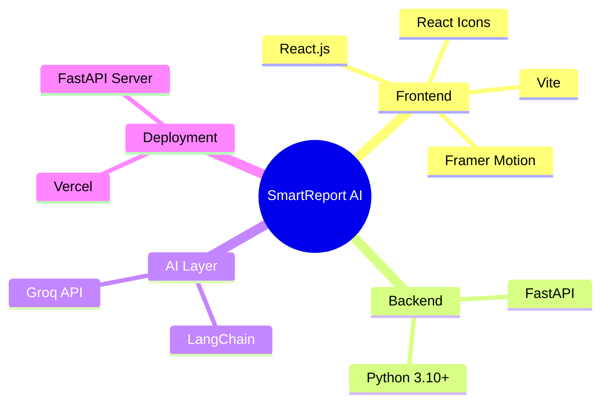
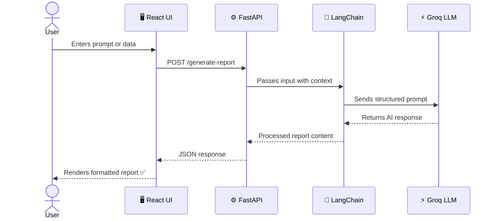

<div align="center">

<!-- Animated Cylinder Banner - different from waving/slice -->


<br/>

<br/><br/>

<!-- Animated snake contribution graph style separator -->


<br/>

<!-- Pill-style badges - different from for-the-badge and flat-square -->

&nbsp;

&nbsp;

&nbsp;

&nbsp;

&nbsp;


<br/><br/>

<!-- Metrics row -->


<br/><br/>


&nbsp;

&nbsp;


</div>

---

<br/>

## 📌 Problem Statement


**Manually writing reports is a productivity killer.**

Every day, professionals waste hours converting raw data into structured documents — formatting, restructuring, and rewriting content that an AI could handle in seconds.

SmartReport AI replaces that entire workflow with a single prompt.

- ❌ No more copy-pasting into templates
- ❌ No more manual formatting
- ✅ Just describe what you need — get a polished report instantly

<br clear="right"/>

---

## 💡 How It Works

<div align="center">

```
┏━━━━━━━━━━━━━━━━━━━━━━━━━━━━━━━━━━━━━━━━━━━━━━━━┓
┃                                                ┃
┃    📝  You type a prompt or paste raw data     ┃
┃                      ↓                         ┃
┃    🦜  LangChain understands the context       ┃
┃                      ↓                         ┃
┃    ⚡  Groq fires the LLM at lightning speed   ┃
┃                      ↓                         ┃
┃    📄  A structured report is born             ┃
┃                      ↓                         ┃
┃    🖥️  Rendered live in the React UI           ┃
┃                                                ┃
┗━━━━━━━━━━━━━━━━━━━━━━━━━━━━━━━━━━━━━━━━━━━━━━━━┛
```

</div>

<br/>

---

## 🧠 Key Features

<div align="center">

| | Feature | What It Means For You |
|:---:|---|---|
| ✨ | **AI Report Generation** | Go from raw input to polished report in seconds |
| ⚡ | **Groq-Powered Speed** | LLM inference so fast it feels instantaneous |
| 🧩 | **LangChain Context** | Multi-turn awareness for accurate, coherent reports |
| 🎨 | **Animated React UI** | Framer Motion powered — smooth, modern, satisfying |
| 🌍 | **Domain-Agnostic** | Works for business, research, healthcare, education & more |
| 🔌 | **Modular Architecture** | Swap AI models or add new export formats with ease |

</div>

<br/>

---

## 🏗️ Tech Stack

<div align="center">



</div>

<br/>

---

## ⚙️ System Architecture



<br/>

---

## 📂 Project Structure

```bash
SmartReportAI/
│
├── 🗂️  backend/
│   ├── 🐍  main.py                  # FastAPI app entry point
│   ├── 📋  requirements.txt         # Python dependencies
│   ├── 🔧  services/
│   │   ├── llm_service.py           # Groq + LangChain integration
│   │   └── report_service.py        # Report structuring logic
│   └── 🛠️  utils/
│       └── helpers.py               # Shared utility functions
│
├── 🗂️  frontend/
│   └── 📁  src/
│       ├── components/              # Reusable UI components
│       ├── pages/                   # Full page views
│       └── assets/                  # Images, fonts, styles
│
└── 📖  README.md
```

<br/>

---

## 🚀 Getting Started

> **Prerequisites:** Node.js v18+ · Python 3.10+ · Groq API Key ([get one here](https://console.groq.com))

---

### `Step 1` — Clone

```bash
git clone https://github.com/yourusername/SmartReportAI.git
cd SmartReportAI
```

---

### `Step 2` — Backend

```bash
cd backend

# Set up virtual environment
python -m venv venv
venv\Scripts\activate          # Windows
# source venv/bin/activate     # macOS / Linux

# Install Python packages
pip install -r requirements.txt

# Configure API key
echo "GROQ_API_KEY=your_key_here" > .env

# Launch server
uvicorn main:app --reload
```

<div align="center">

| Service | URL |
|---|---|
| 🟢 API Server | `http://127.0.0.1:8000` |
| 📘 Swagger Docs | `http://127.0.0.1:8000/docs` |

</div>

---

### `Step 3` — Frontend

```bash
cd frontend
npm install
npm run dev
```

<div align="center">

| Service | URL |
|---|---|
| 🟢 Dev Server | `http://localhost:5173` |

</div>

<br/>

---

## 🌐 API Reference

<div align="center">

| Method | Endpoint | Description | Status |
|:---:|---|---|:---:|
| `POST` | `/generate-report` | Generate structured report from input | ✅ |
| `GET` | `/health` | Server health check | ✅ |
| `POST` | `/summarize` | Summarize raw text content | ✅ |

</div>

<br/>

---

## 📈 Roadmap

<div align="center">

```
 COMPLETED                          UPCOMING
─────────────────────────────────────────────────────
 ✅ AI Report Generation            📄 PDF / DOCX Export
 ✅ LangChain Context Engine        📊 Data Visualizations
 ✅ Groq API Integration            🧠 Multi-Agent Workflows
 ✅ React + Framer Motion UI        🗂️  Report History & Storage
                                    🔐 User Auth System
                                    🌙 Dark Mode
                                    📱 Mobile Redesign
```

</div>

<br/>

---

## 🤝 Contributing

```bash
# The contribution loop
git fork → git branch → git commit → git push → open PR 🎉
```

1. **Fork** this repo
2. **Branch** off: `git checkout -b feature/your-feature`
3. **Commit** it: `git commit -m "feat: describe your change"`
4. **Push** it: `git push origin feature/your-feature`
5. **PR** it — we'll review promptly!

<br/>

---

## 📄 License & Acknowledgements

Licensed under **MIT** — see [`LICENSE`](LICENSE) for details.

<div align="center">

| Built on the shoulders of giants |
|---|
| [Groq](https://groq.com) — for near-instant LLM inference |
| [LangChain](https://langchain.com) — for intelligent context chaining |
| [FastAPI](https://fastapi.tiangolo.com) — for the sleek Python backend |
| [Framer Motion](https://framer.com/motion) — for buttery-smooth UI animations |

</div>

<br/>

---

<div align="center">

<!-- Colorful stats cards -->


<br/><br/>

<!-- Egg/drum-style footer - completely different from wave/slice -->


<br/>

**SmartReport AI — Because your time is worth more than formatting.**

[](https://github.com/yourusername)
&nbsp;
[](https://github.com/yourusername/SmartReportAI)

</div>
